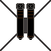
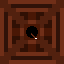
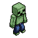

# TowerPlunger

Hello and welcome to my tower defence game its pretty simple and should be quite easy to play but dont expect it to be a walk in the park because its kinda hard to test and balance on my own
  so in that sence some levels might be a alot harder then they should be also im not doing any animations or game saves cuz like why for a game of this size, below you will also find information
  about the towers, upgrades, enemies and some level details.
## Reminder 👍
  - This game was made purely for fun and learning purposes do not expect to be "blown away" enjoy the simplicity and stay tuned for my next
  projects in the future, who knows maybe its gonna be somethink decent this time that i did not take so long to do for not that big of a result.

## Keybinds
  - "ESCAPE" button will pause the game if you have a level open
  - ❗ "Right mouse button" deselects a tower if you have its menu open, this is very important because you cant switch to another tower otherwise ❗

## How to play
  - simply just double click on the TowerPlunger.vbs file and when you get that warning window you need to agree to run the file, its just a thing the computer does when you try to run a file with no digital
      license or newly installed aps for obvious security reasons.
  - once its starts up select a level, once you do you will have 10s to place a tower and upgrade it if you want, expect the level to be like 5-15m long.

## Towers
  ### Cannon
  
  - basic tower thats meant to be placed at the start and replaced later
  - its first upgrade path is focused on dealing damage while the second has hidden detection to detect enemies with the "hidden" trait.

  ### Multi Cannon
  
  - rapid-fire tower that shoots multiple weaker shots
  - its first upgrade path boosts overall DPS and later becomes a heavy multi-shot cannon
  - its second path adds hidden detection early and turns into a long-range shredder with high pierce

  ### Ice Tower
  
  - slows enemies with freezing projectiles and deals small amounts of chip damage
  - first path upgrades focus on stronger freeze bursts and larger splash radius
  - second path specializes in area slows and bigger splash zones, eventually covering huge portions of the map
  
  ### Railgun Tower
  
  - precision long-range tower that pierces through enemies
  - first path improves single-target power, turning it into an extremely strong sniper with high pierce
  - second path adds more consistent piercing shots and very high range at later levels
  
  ### Bomb Tower
  
  - deals explosive splash damage, great for groups
  - first path increases explosion radius and damage, becoming a heavy AOE nuker
  - second path focuses on faster firing and wider splash zones, turning into a rapid-fire crowd clearer

## Enemies
  ### Zombie
  
  
