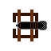

## TowerPlunger

Hello and welcome to my tower defence game its pretty simple and should be quite easy to beat but dont expect it to be a walk in the park because its kinda hard to test and balance on my own
  so in that sence some levels might be a alot harder then they should be also im not doing any animations or game saves cuz like why for a game of this size, below you will also find information
  about the towers, upgrades, enemies and some level details.

# Keybinds
  - "ESCAPE" button will pause the game if you have a level open
❗ - "Right mouse button" deselects a tower if you have its menu open, this is very important because you cant switch to another tower otherwise ❗

# How to play
  - simply just double click on the TowerPlunger.vbs file and when you get that warning window you need to agree to run the file, its just a thing the computer does when you try to run a file with no digital
      license or newly installed aps for obvious security reasons.
  - once its starts up select a level, once you do you will have 10s to place a tower and upgrade it if you want, expect the level to be like 5-15m long.

## Towers
  # Cannon
  - 
  - basic tower thats meant to be placed at the start and replaced later

