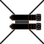
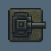
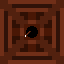

# TowerPlunger

Hello and welcome to my tower defence game its pretty simple and should be quite easy to play but dont expect it to be a walk in the park because its kinda hard to test and balance on my own
  so in that sence some levels might be a alot harder then they should be also im not doing any animations or game saves cuz like why for a game of this size, below you will also find information
  about the towers, upgrades, enemies and some level details.
## Reminder 👍
  - This game was made purely for fun and learning purposes do not expect to be "blown away" enjoy the simplicity and stay tuned for my next
  projects in the future, who knows maybe its gonna be somethink decent this time that i did not take so long to do for not that big of a result.

## Keybinds
  - "ESCAPE" button will pause the game if you have a level open
  - ❗ "Right mouse button" deselects a tower if you have its menu open, this is very important because you cant switch to another tower otherwise ❗

## How to play
  - simply just double click on the TowerPlunger.vbs file and when you get that warning window you need to agree to run the file, its just a thing the computer does when you try to run a file with no digital
      license or newly installed aps for obvious security reasons.
  - once its starts up select a level, once you do you will have 10s to place a tower and upgrade it if you want, expect the level to be like 5-15m long.

## Towers
  ### Cannon
  
  - basic tower thats meant to be placed at the start and replaced later
  - its first upgrade path is focused on dealing damage while the second has hidden detection to detect enemies with the "hidden" trait
  ### Multi Cannon
  
  - rapid-fire tower that shoots multiple weaker shots
  - its first upgrade path boosts overall DPS and later becomes a heavy multi-shot cannon
  - its second path adds hidden detection early and turns into a long-range shredder with high pierce
  ### Ice Tower
  
  - slows enemies with freezing projectiles and deals small amounts of chip damage
  - first path upgrades focus on stronger freeze bursts and larger splash radius
  - second path specializes in area slows and bigger splash zones, eventually covering huge portions of the map
  ### Railgun Tower
  
  - precision long-range tower that pierces through enemies
  - first path improves single-target power, turning it into an extremely strong sniper with high pierce
  - second path adds more consistent piercing shots and very high range at later levels
  ### Bomb Tower
  
  - deals explosive splash damage, great for groups
  - first path increases explosion radius and damage, becoming a heavy AOE nuker
  - second path focuses on faster firing and wider splash zones, turning into a rapid-fire crowd clearer

## Enemies
  ### Fast Zombie
  
  - lowest-tier enemy with very low hp but very high speed
  - has no traits, just rushes forward quickly
  ### Skeleton
  
  - fragile undead enemy with low hp and slightly higher speed than zombie
  - no traits, simple filler unit
  ### Zombie
  
  - basic enemy with mediocre hp and moderate speed
  - no traits, generally not a threat
  ### Slime
  
  - squishy creature with average hp and mid-range speed
  - harmless besides its small damage output
  ### Hidden
  
  - invisible enemy requiring detection to reveal
  - moderate hp and speed, slightly more dangerous due to stealth
  ### Bone Reaper
  
  - hidden + armored hybrid with solid hp and decent speed
  - tougher than early enemies because towers need detection and its armored trait is giving him damage reduction
  ### Tank
  
  - slow but very tanky early-mid game unit
  - armored trait reduces incoming damage
  ### Pink Slime
  
  - heavy variant of the normal slime
  - thick hp pool and armored, slow but annoying to burst down
  ### Armored Skeleton
  
  - extremely armored skeleton with high hp
  - slow, but its armor makes it a durable mid-tier mini-tank
  ### Normal Boss
  
  - traditional mid-game boss with large hp and moderate speed
  - no traits but strong enough to overwhelm weak defenses
  ### Hidden Boss
  
  - stealth boss with solid hp and moderate speed
  - requires detection and respectable DPS to handle
  ### Skeleton King
  
  - heavy armored skeleton boss with a large hp pool
  - slow but hits hard
  ### Fast Boss
  
  - high-speed boss with very large hp and strong damage
  - outruns towers easily if not slowed
  ### Tank Boss
  
  - massivly armored boss with very high hp
  - slow but extremely dangerous if it reaches the end
  ### Hidden Brainrot
  
  - hidden + armored → resistant to normal damage
  - very high hp, dangerous damage, and mid-range speed
  ### Destroyer
  
  - incredibly deadly titan with massive hp and huge damage
  - armored and fast
  ### Gravedigger
  
  - ultra-tank with gigantically high hp but slow movement
  - armored
  ### Ghost Phantasm
  
  - hidden + armored with enormous hp
  - faster than expected and absolutely devastating
  ### Your Nightmare
  
  - surreal late-game threat with extreme hp and brutal damage
  - surprisingly quick for its size
  ### Screen Muncher
  
  - armored predator with absurd hp and high movement speed
  - hits incredibly hard but gives a huge reward
  ### Ultimate Boss
  
  - an armored super-boss with ridiculously high hp
  - moves fast and deals massive damages
  ### The ONE
  
  - the final existence — colossal hp with no reward
  - slow but completely overwhelming
